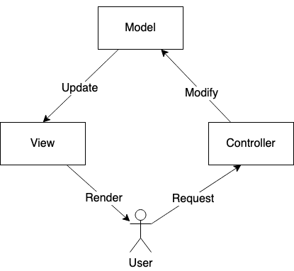
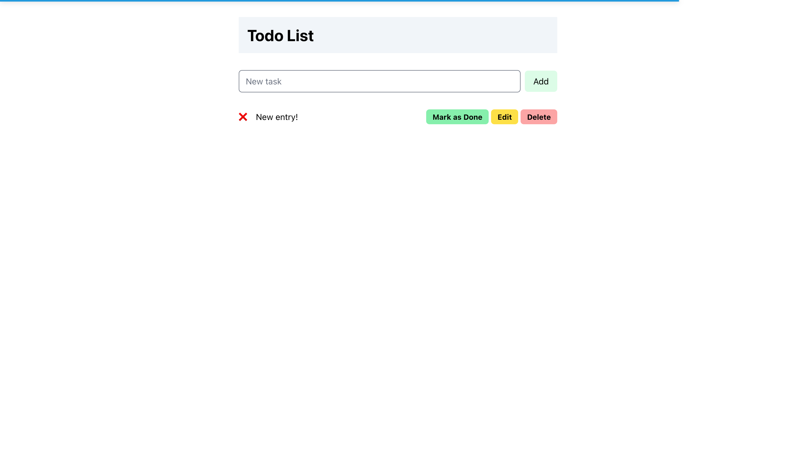
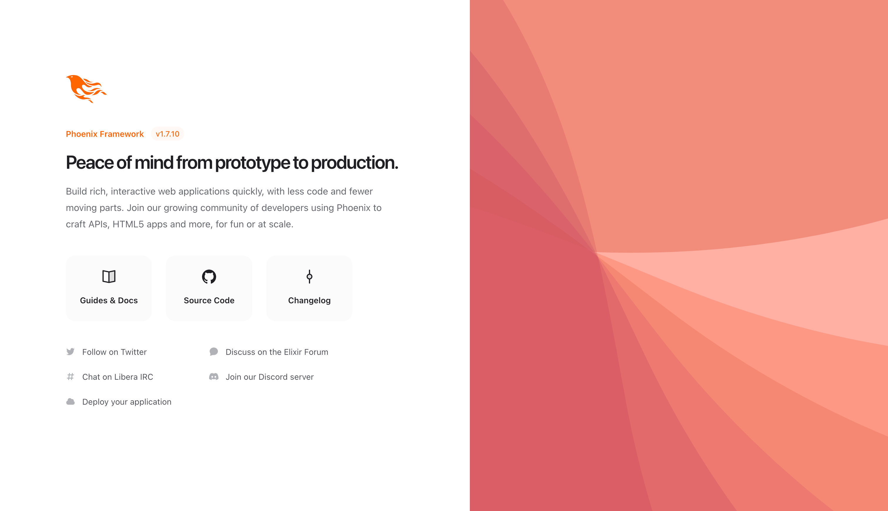

# Practical Functional Programming

<script type="module">
  import mermaid from 'https://cdn.jsdelivr.net/npm/mermaid@10/dist/mermaid.esm.min.mjs';
  mermaid.initialize({
    startOnLoad: true,
    theme: 'dark'
  });
</script>

By: Jiahao

Presented at: NUS Hackers Hackerschool

Presented on: 15 February 2024

---

# About me

<div class="left-heavy-two-column">
    
    <div>
        <p>My name is <strong>Jiahao!</strong></p>
        <ul>
            <li>CS Undergraduate @ NUS</li>
            <li>Coreteam @ NUS Hackers</li>
            <li>
                Elixir Enthusiast
                <ul>
                    <li>Written several articles about Elixir</li>
                    <li>Did summer intern at Betafi using Elixir full-time in production</li>
                    <li>Done Advent of Code 2020/21/22/23 in Elixir</li>
                </ul>
            </li>
        </ul>
    </div>
</div>

---

# Agenda Today

1. What is this talk about?
2. Prerequisites
3. What is functional programming?
4. Why functional programming?
5. Brief history of Elixir
6. Why Elixir?
7. **!Elixir fundamentals**
8. **!Introducing Phoenix**
9. Conclusion

---

# What this talk is about

<div class="even-two-column">
    <ul>
        <li>✅ Fundamental understanding of FP</li>
        <li>✅ New perspective on FP</li>
        <li>✅ Introduce basic web dev with Elixir + Phoenix</li>
    </ul>
    <ul>
        <li>❌ Convince you that FP >> all else</li>
        <li>❌ Go super in-depth with Elixir syntax</li>
        <li>❌ Teach everything about Phoenix</li>
        <li>❌ Claim Elixir is the only production ready FP language</li>
    </ul>
</div>

---

# Prerequisites

- Have Elixir installed
- Have SQLite3 installed (optional)
- Fundamentals of programming (variables, loops, functions, etc)

---

# Accompanying Guide

More information-dense compared to these slides

[https://hckr.cc/practical-elixir]


---

# What is functional programming? (FP)

<div class="even-two-column">
    <div style="width: 100%;">
        <pre style="font-size: 16px; text-align: left;">
lst
    .stream()
    .map(x -> x * 2)
    .reduce(1, (acc, el) -> acc * el)
    .collect(Collectors.toList());
        </pre>
        <p>From CS2030S?</p>
    </div>
    <div>
        <pre style="font-size: 14px; text-align: left;">
quicksort2 :: (Ord a) => Array Int a -> Array Int a
quicksort2 inputArr = runSTArray $ do
stArr <- thaw inputArr
let (minIndex, maxIndex) = bounds inputArr
quicksort2Helper minIndex (maxIndex + 1) stArr
return stArr
quicksort2Helper :: (Ord a)
=> Int
-> Int
-> STArray s Int a
-> ST s ()
quicksort2Helper start end stArr = when (start + 1 < end) $ do
pivotIndex <- partition stArr start end
quicksort2Helper start pivotIndex stArr
quicksort2Helper (pivotIndex + 1) end stArr
        </pre>
        <p>Haskell?</p>
    </div>
</div>

---

# A (somewhat) formal definition...

> _Programming paradigm_ that involves _composing programs from functions_ and treating these
> functions as _first-class citizens_ in the language

---

# So, what is FP?

> Functional programming is an _alternative way of thinking_ and solving problems by using
> _functions as the fundamental building blocks_

---

# Traits of FP

1. First-class functions
2. Pure functions
3. Recursion
4. Referential transparency
5. Type system

---

## First-class functions

Pass functions as arguments and return functions

---

## Pure functions

$f : x \mapsto y$

The only change in program state happens with the input and output of the function

No other changes to be made to program state (i.e. _side effects_)

---

## Recursion

$f(x) = f(x - 1) + f(x - 2)$

No iterative loops

Function calling itself till some base case is achieved

---

## Referential transparency

```elixir
x = [1, 2, 3]

def fn(y) do
    y = [4, 5, 6]
end

fn(x)
x      # still [1, 2, 3]
```

Once initialized, the value of a variable cannot change

---

## Type system

Defines set of rules that govern what a type can contain

Useful for creating domain-specific types

---

# Why FP?

1. Improves problem solving skills
2. Pure functions reduce worry of side effects
3. Referential transparency avoids unintended state changes
4. Robust type system == representing domain logic better

---

# Why FP, actually?

### Because it's fun!!

---

# Introducing Elixir


---

# Brief history of Elixir

- Created by Jose Valim in 2011
- Former Ruby on Rails core contributor
- Incorporates FP referential transparency with Erlang VM + OTP
- Syntax similar to Ruby's syntax
- Designed to build highly concurrent and distributed systems

---

# Why Elixir?

- Gentle introduction to functional programming concepts
- Used by major companies like Discord, Heroku, Mozilla, and Betafi
- Used in various fields like IoT (Nerves), distributed systems (OTP), and web development (Phoenix)

---

# Agenda till this point

1. What is this talk about?
2. Prerequisites
3. What is functional programming?
4. Why functional programming?
5. Brief history of Elixir
6. Why Elixir?  **<- You are here!**
7. **!Elixir fundamentals**
8. Introducing Phoenix
9. Conclusion

---

# Elixir fundamentals

1. Types
2. Pattern matching
3. Modules
4. Functions
5. Conditionals
6. Recursion
7. Enumerables
8. Mix (covered in guide)

---

# Running Elixir code

## Terminal

```bash
iex
```

```elixir
λ ~/ iex
Erlang/OTP 26 [erts-14.2.1] [source] [64-bit] [smp:8:8] [ds:8:8:10] [async-threads:1] [jit] [dtrace]

Interactive Elixir (1.16.0) - press Ctrl+C to exit (type h() ENTER for help)
iex(1)>
```

---

## Elixir scripts

1. Create file ending with `*.exs`
2. Run file via `elixir <file>.exs`

---

## Types

- Dynamically typed
- Relies on dialyzer to provide type checking using type annotations
- Referential transparency is important

---

### Types roadmap

Very fast to cover! All fundamental data types in other languages

<div class="even-two-column">
    <ol>
        <li>Basic types</li>
        <li>Arithmetic</li>
        <li>Boolean operations</li>
        <li>nil</li>
        <li>Atoms</li>
    </ol>
    <ol start="6">
        <li>Strings</li>
        <li>Structural comparison</li>
        <li>Lists</li>
        <li>Tuples</li>
        <li>Keyword lists</li>
        <li>Maps</li>
    </ol>
</div>

---

### Basic types

```elixir
x = 1        # integer
x = 0.5      # float
x = true     # boolean
x = :atom    # atom
x = "elixir" # string
```

---

### Arithmetic

```elixir
iex(1)> 1 + 1
2
iex(2)> 2 * 3
6
iex(3)> 3 / 2
1.5
iex(4)> 3 - 2
1
iex(5)> div(3, 2)
1
iex(6)> rem(3, 2)
1
```

---

### Boolean operations

```elixir
iex(17)> true and true
true
iex(18)> true and false
false
iex(19)> false or true
true
iex(20)> not true
false
```

Short circuit operators!

---

### `nil`

Absence of value

`nil` and `false` are falsy values with everything else as truthy values

---

### Atoms

```elixir
iex(24)> x = :apple
:apple
iex(25)> x == :apple
true
```

---

### Strings

```elixir
iex(26)> str = "Hello world!"
"Hello world!"

iex(27)> str <> " said the computer"
"Hello world! said the computer"

iex(31)> "The computer said '#{str}'"
"The computer said 'Hello world!'"
```

---

### Structural comparisons

```elixir
iex(32)> 1 == 1
true
iex(33)> "a" == "a"
true
iex(34)> 1 != 2
true
iex(35)> 1 < 2
true
iex(36)> 1 == 1.0
true
```

Strict comparisons using `===` and `!===`

---

### Lists

Linked lists

```elixir
iex(2)> x = ["hi", 1, true, :atom]
["hi", 1, true, :atom]

iex(3)> [1, 2] ++ [4, 5]
[1, 2, 4, 5]

iex(4)> [1, 2, 3] -- [2, 3]
[1]

iex(5)> length(x)
4
```

---

### Tuples

Fixed-sized & contiguous memory

```elixir
iex(7)> t = {:ok, "hello", 1}
{:ok, "hello", 1}

iex(8)> elem(t, 2)
1
iex(9)> elem(t, 1)
"hello"

iex(10)> tuple_size(t)
3
```

Zero-based index

---

### Keyword lists (1)

Pass options to functions

```elixir
iex(11)> String.split("hello world  another ", " ", trim: true)
["hello", "world", "another"]
```

Declaration

```elixir
iex(12)> x = [a: 0, a: 1, b: 2]
[a: 0, a: 1, b: 2]
iex(15)> [{:a, 0}, {:a, 1}, {:b, 2}]
[a: 0, a: 1, b: 2]
```

---

### Keyword lists (2)

Accessing elements

```elixir
iex(16)> x[:b]
2
```

**Properties:**

1. Atoms as keys
2. Order dependent
3. Allows duplicate keys

---

### Maps (1)

Hashmaps in other languages

Store key-value pairs

```elixir
iex(18)> m = %{:a => 1, "hello" => "world", 2 => :c}
%{2 => :c, :a => 1, "hello" => "world"}

iex(19)> m[:a]
1
iex(20)> m[2]
:c
iex(21)> m.a
1
```

---

### Maps (2)

Updating values

```elixir
%{map | key: new_value}
```

**Properties:**

1. Anything as keys
2. Not order dependent
3. Disallows duplicate keys (values are just overridden)

---

## Pattern matching

`=` operator -> "match" operator

Matches the LHS and RHS of an expression

```elixir
iex(1)> x = 1 # This is assigning the value 1 to variable x
1
iex(2)> 1 = x # This is matching the value of variable x to 1 (checks if LHS == RHS)
1
iex(3)> 2 = x # This fails because variable x holds value of 1, so the match fails
** (MatchError) no match of right hand side value: 1
    (stdlib 5.2) erl_eval.erl:498: :erl_eval.expr/6
    iex:3: (file)
```

---

### Pattern matching (Lists)

```elixir
iex(8)> l = [1, 2, 3, 4, 5, 6]
[1, 2, 3, 4, 5, 6]
iex(9)> [h | t] = l
[1, 2, 3, 4, 5, 6]
iex(10)> h
1
iex(11)> t
[2, 3, 4, 5, 6]
```

---

### Pattern matching (Tuples)

```elixir
iex(3)> x = {:a, "hello", 1}
{:a, "hello", 1}
iex(4)> {atom_var, str_var, num_var} = x
{:a, "hello", 1}
iex(5)> atom_var
:a
iex(6)> str_var
"hello"
iex(7)> num_var
1
```

---

### Pattern matching (Ignore operator)

```elixir
iex(12)> [a | _] = l
[1, 2, 3, 4, 5, 6]
iex(13)> a
1
```

---

### Pattern matching (Maps)

```elixir
iex(15)> %{:a => a, "hello" => world_var, 2 => _} = d
%{2 => :b, :a => 1, "hello" => "world"}
iex(16)> a
1
iex(17)> world_var
"world"
```

---

### Pattern matching (Deeply nested structures)

```elixir
iex(18)> n = [:a, %{"hello" => "world", :b => %{"nested" => "value"}}]
[:a, %{:b => %{"nested" => "value"}, "hello" => "world"}]

iex(19)> [_, %{:b => %{"nested" => nested_var}}] = n
[:a, %{:b => %{"nested" => "value"}, "hello" => "world"}]

iex(20)> nested_var
"value"
```

---

## Modules

Way to package like functions

```elixir
defmodule Math do
    def add(a, b) do
        a + b
    end

    def subtract(a, b) do
        a - b
    end
end

IO.puts(Math.add(5, 3))
```

---

## Functions

```elixir
def function_name(function_parameters) do
    # ...
end
```

Impure functions are allowed but discouraged

---

### Return values

Automatically set as the final expression in function body

```elixir
def format_person(name, age, school) do
    "#{name} is #{age} years old and attends #{school}"
end
```

---

### Quality of life

Omit parentheses and use of `end`

```elixir
def foo, do: 5
```

---

### Function overloading

Same name, differing parameters

```elixir
def foo(a, b), do: a + b
def foo(a), do: a
def foo, do: nil
```

---

### Default arguments

Must be last in parameter list

```elixir
def minus(a, b \\ 0) do
    a - b
end
```

---

### Pattern matching

$$
f(n) = \begin{cases}
    0, n = 0 \\
    1, n = 1 \\
    f(n - 1) + f(n - 2)
\end{cases}
$$

```elixir
def fib(0), do: 1
def fib(1), do: 1
def fib(n), do: fib(n - 1) + fib(n - 2)

def fib(_), do: nil # Drop down clause
```

---

### Guard clauses

Validate argument before function body is run

```elixir
def fib(n) when n < 0, do: nil
def fib(n) when n == 0 or n == 1, do: 1
def fib(n), do: fib(n - 1) + fib(n - 2)

def abs_minus(a, b) when a < b, do: b - a
def abs_minus(a, b), do: a - b
```

Limited to [certain functions](https://kapeli.com/cheat_sheets/Elixir_Guards.docset/Contents/Resources/Documents/index)

---

### Anonymous functions

Declared without `def`

Used to pass functions around or as return values

```elixir
pow_two = fn x -> x * x end
pow_two.(4) # returns 16
```

---

### Closures

Anonymous functions have access to variables that are in scope when declared

```elixir
def foo do
    x = 42
    bar = fn -> x * 2 end
    bar.() # returns 84
end
```

---

## Conditionals

1. `case`
2. `if`
3. `cond`
4. `unless`

---

### `case`

Compare given value against many patterns

```elixir
case {1, 2, 3} do
    {1, 2, 5} -> "This will not return"
    {4, 5, 6} -> "Neither will this"
    {1, x, 3} -> "This will work with any #{x}"
    _ -> "This is used as the 'default' case"
end
```

Works with guard clauses too

---

### Pin operator (`^`)

"Locks" variable at time of use to prevent re-assignment

```elixir
x = 5
case {1, 2, 3} do
    {1, 2 ^x} -> "This will also try matching {1, 2, 5} and fail"
    _ -> "This will be the result"
end
```

---

### `if`

Same as other languages

No `elif` clause

```elixir
if x > 3 do
    "Greater"
else
    if x < 0 do
        "Negative"
    else
        "Lesser"
    end
end
```

---

### `case`

Effectively a nested `if` statement

```elixir
cond do
    x > 3 -> "Greater"
    x < 0 -> "Negative"
    true -> "Lesser"
end
```

---

### `unless`

Expression must evaluate to `false` to run

```elixir
unless true do
    "This will not return"
end
```

---

### Returning conditionals

1. Expressions can be returned
2. Conditionals are expressions
$\therefore$ Conditionals can be returned

```elixir
def foo do
    if true do
        "This is returned"
    else
        "This isn't"
    end
end
```

---

## Recursion

Function calling itself

**Tail-call optimization:** using only one stack frame for recursive calls
(Only if last expression is recursive call)

---

### Recursive patterns (Mapping)

<div class="even-two-column">
    <div>
        <pre>
x = [1, 2, 3]
for i in range(len(x)):
    x[i] *= 2
print(x)
        </pre>
        <p>Python</p>
    </div>
    <div>
        <pre style="font-size: 21px;">
def map([], res), do: res
def map([xi | rest], res),
    do: map(rest, res ++ [xi * 2])
        </pre>
        <p>Elixir</p>
    </div>
</div>

---

### Recursive patterns (Reducing)

<div class="even-two-column">
    <div>
        <pre>
x = [1, 2, 3, 4]
s = 0
for i in range(len(x)):
    s += x[i]
print(s)
        </pre>
        <p>Python</p>
    </div>
    <div>
        <pre style="font-size: 21px;">
def sum([], acc), do: acc
def sum([xi | rest], acc),
    do: sum(rest, acc + xi)
        </pre>
        <p>Elixir</p>
    </div>
</div>

---

### Recursive patterns (Filtering)

<div class="even-two-column">
    <div>
        <pre style="font-size: 23px;">
x = [1, 2, 3, 4, 5]
filtered = []
for i in range(len(x)):
    if x[i] & 1 == 1:
        filtered.append(x[i])
        </pre>
        <p>Python</p>
    </div>
    <div>
        <pre style="font-size: 21px;">
def filter([], acc), do: acc<br>
def filter([xi | rest], acc)
    when Integer.is_even(xi),
    do: filter(rest, acc)<br>
def filter([xi | rest], acc),
    do: filter(rest, acc ++ [xi])
        </pre>
        <p>Elixir</p>
    </div>
</div>

---

## Enumerables

`Enum` module containing frequently used utility functions

1. `Enum.all?`
2. `Enum.any?`
3. `Enum.at`
4. `Enum.filter`
5. `Enum.map`
6. `Enum.reduce`

---

### Function chaining

Used when passing output of one function to input of another using pipe (`|>` operator)

```elixir
Enum.map(Enum.filter(1..10, fn x -> Integer.is_odd(x) end), fn x -> x * 2 end)
```

Do this instead

```elixir
1..10
|> Enum.filter(fn x -> Integer.is_odd(x) end)
|> Enum.map(fn x -> x * 2 end)
```

---

# Time for Phoenix!


---

# What is Phoenix?

- Server-side web framework
- Created by Chris McCord
- Modeled after Ruby on Rails framework

---

# Model-View-Controller (MVC) pattern



---

# What will we do?

Building a simple to-do list application



---

# Structure

1. Directory structure of Phoenix projects
2. Request lifecycle
3. Representing to-do items in Elixir
4. Anatomy of routers
5. Creating a new HTTP endpoint
6. Rendering to-do list
7. Adding dynamic actions to to-do list
8. Persisting data with Ecto & SQLite3 (may not cover)

---

# Getting started

Install Phoenix CLI

```bash
mix archive.install hex phx_new
```

Setup new Phoenix project

```bash
mix phx.new practical_elixir_demo --database sqlite3
```

Navigate to folder

```bash
cd practical_elixir_demo
```

---

# Getting started

Setup database

```bash
mix ecto.create
```

Run application

```bash
mix phx.server
```

---



---

# Directory structure

```
.
├── .formatter.exs
├── .gitignore
├── README.md
├── _build
├── assets
│   ├── css
│   ├── js
├── config
├── lib
│   ├── practical_elixir_demo/
│   ├── practical_elixir_demo_web/
├── mix.exs
├── mix.lock
├── practical_elixir_demo_dev.db
├── priv
└── test
```

---

# Request lifecycle

<div class="mermaid">
sequenceDiagram
    actor User
    participant Client
    participant Server
    participant Database
    User ->> Client : perform action
    Client ->> Server : HTTP request
    Server ->> Database : fetch information
    Database -->> Server : information
    Server -->> Client : HTTP response
    Client -->> User : render result of action
</div>

---

# Basic HTTP

<div class="even-two-column" style="align-items: center;">
    <div style="text-align: right; margin-right: 1em;">
        <p>GET</p>
        <p>POST</p>
        <p>PUT</p>
        <p>DELETE</p>
    </div>
    <p style="text-align: left; margin-left: 1em;">/endpoint</p>
</div>

---

# Structs in Elixir

```elixir
defmodule PracticalElixirDemo.Todo.TodoItem do
  @derive Jason.Encoder
  defstruct [:title, description: nil, is_done?: false]
end
```

---

# Anatomy of a router

1. `use`
2. Pipelines
3. Scopes
4. Declaring routes

---

# Creating new endpoint

1. Add route to scope in `router.ex`
2. Add controller action in respective controller file

---

# Creating new page

1. Add route to scope in `router.ex`
2. Add controller action to render view
3. Add template file to render page with content

---

> "But I don't want to use JavaScript!"
> \- Presumably you

---

# LiveView lifecycle

<div class="mermaid">
%%{ init: { 'themeVariables': { 'fontSize': '8px' }, 'flowchart': { 'nodeSpacing': 4, 'rankSpacing': 25 } } }%%
flowchart TD
    HTTP_Request["HTTP Request"]
    initial["Initial Setup"]
    LiveView_Connects["LiveView Connects (Stateful views are spawned)"]
    mount_connected["mount/3 Callback (Connected)"]
    handle_params_connected["handle_params/3 Callback (Connected)"]
    render_connected["render/1 Callback (Connected)"]
    Continuous_Connection["Continuous Connection"]
    handle_event["Callbacks"]
    Reconnect["Reconnect"]
    HTTP_Request --> initial
    initial --> LiveView_Connects
    LiveView_Connects --> mount_connected
    mount_connected --> handle_params_connected
    handle_params_connected --> render_connected
    render_connected --> Continuous_Connection
    Continuous_Connection --> handle_event
    handle_event --> render_connected
    Continuous_Connection -- "If crash or connection drop" --> Reconnect
    Reconnect --> mount_connected
    Continuous_Connection -- "Patch" --> handle_params_connected
    classDef orange fill:#f66,stroke:#333;color:#fff
    class mount_connected orange;
    class Continuous_Connection orange;
    class handle_event orange;
</div>

---

# Migrating to LiveView

For this workshop:

```bash
git fetch
git switch liveview-base
```

Full steps in guide

---

# Thank you!

---

# Feedback


