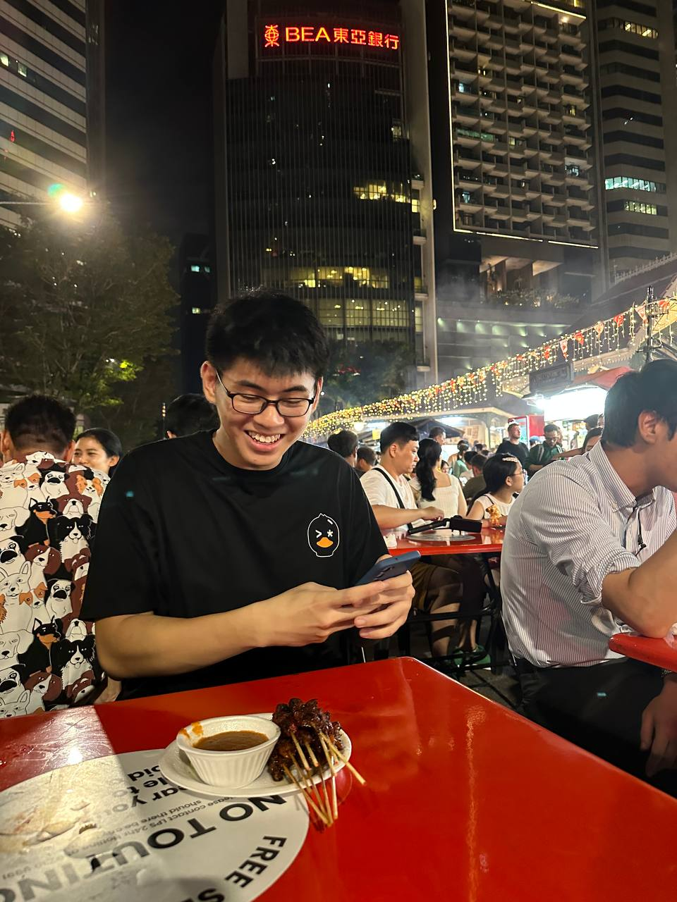
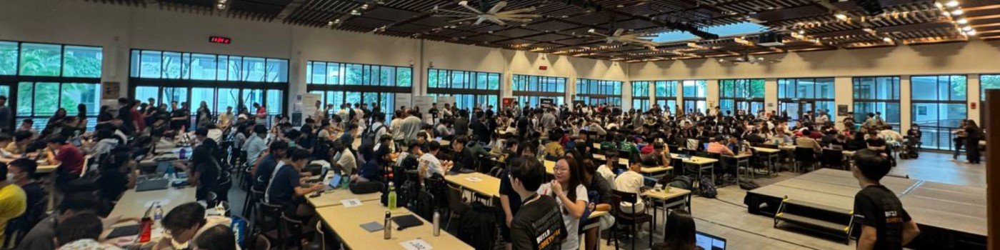
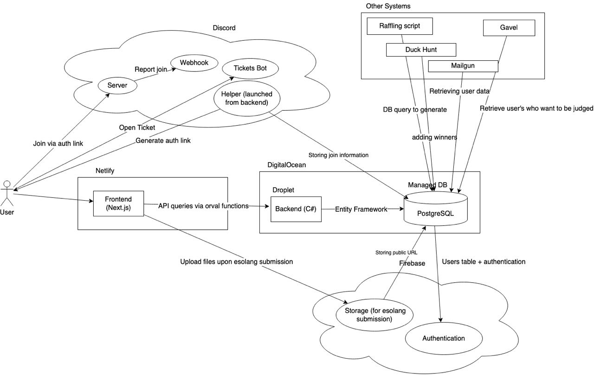
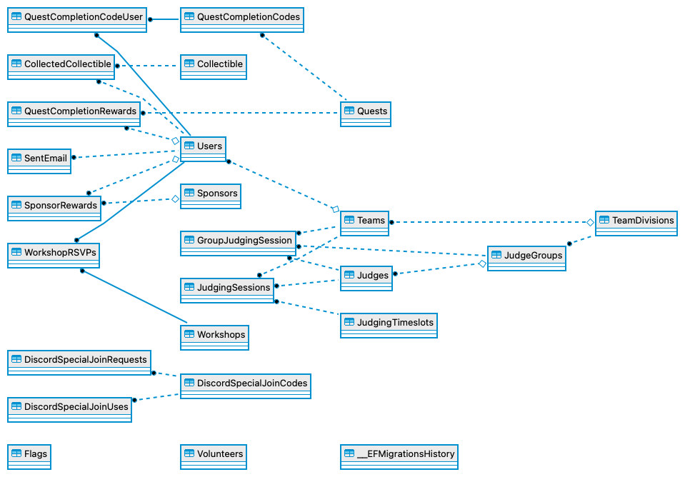
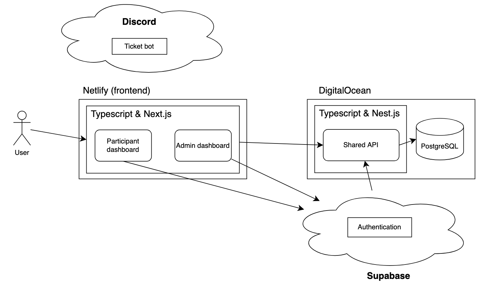
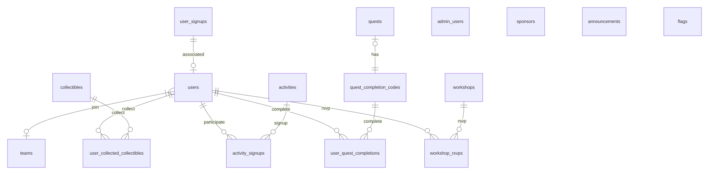
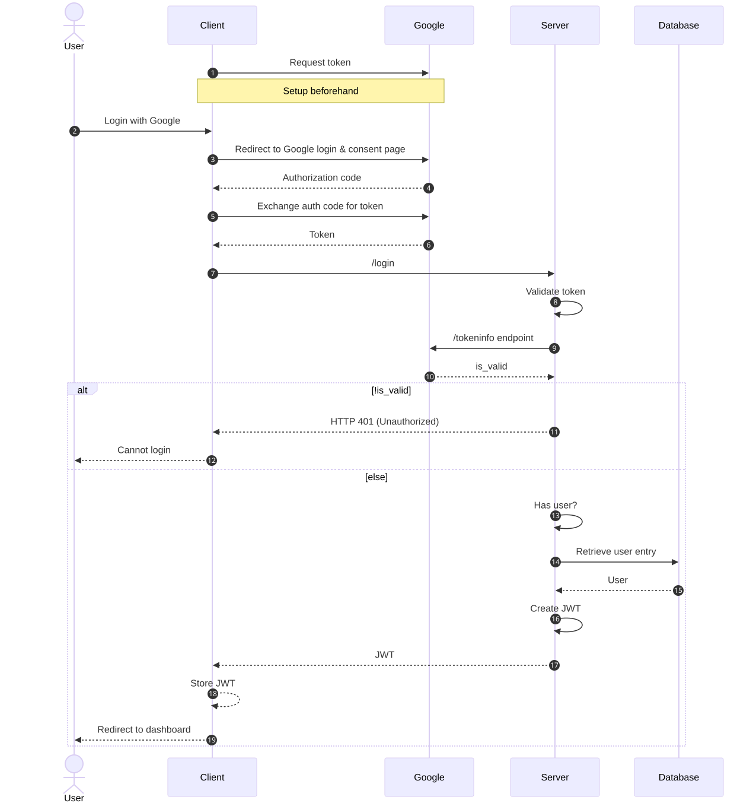
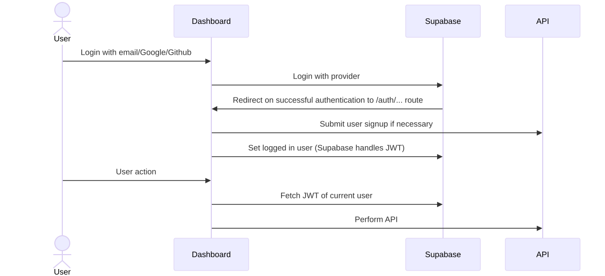
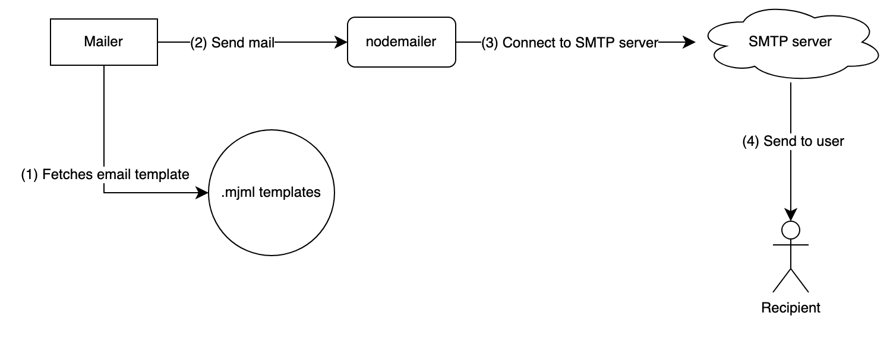

<style>
  :root {
    font-family: 'Arial', sans-serif, 'Source Code Pro', 'Iosevka' !important;
    font-size: 32px;
  }

  h2 {
    font-family: 'Iosevka' !important;
  }
</style>

# Rewriting the Hack&Roll WebApp

Presented by: Jiahao, Woo <<woojiahao1234@gmail.com>>

---

## $ whoami

---

<div class="left-heavy-two-column">
    
    <div>
        <p>My name is <strong>Jiahao!</strong></p>
        <ul>
            <li>CS Undergraduate @ NUS</li>
            <li>Elixir enthusiast &amp; occasional climber</li>
            <li>I have...</li>
            <ul>
              <li>Designed unsupervised stance detection algorithms @ DSO</li>
              <li>Built a unified user research platform @ Betafi</li>
              <li>Designed an automated solution for incident post-mortem generation @ Citadel</li>
            </ul>
            <li><em>Now:</em> Integrating platform API support into Ontology SDK @ Palantir</li>
        </ul>
    </div>
</div>

---

## $ ls presentation/

---

1. What is Hack&Roll?
2. Introduction to Hack&Roll WebApp
3. On-call during Hack&Roll
4. Learning points
5. Designing a new WebApp from the ground up
6. Q&A

---

### ! Disclaimer !

This presentation is not designed to point fingers at any developer! These all happened as a culmination of years of tech debt and hacking things together. This happens even at well established firms so no offense intended, we can all learn from these lessons!

---

## $ man hacknroll

---

### Hack&Roll 2024!



- Largest student run hackathon in Singapore
- Organised by NUS Hackers
- ~650 participants
- ~25 organisers
- 1 on-call person: Me!

---

## $ find ~ -name webapp

---

### Purpose

<em>Central web portal that participants and organisers use</em>

- Allows participants to manage their teams, submissions, raffle points, fringe games, etc.
- Allows organisers and volunteers to manage participant and event information

---

### History

- Started in 2020
- Built around the restrictions of an online hackathon

---

### Tech Stack

- C# (.NET),
- Typescript (Next.js),
- Firebase,
- PostgreSQL

---

### Architecture



---

### Database



**24** tables in total (excluding metadata table)

---

### Inheriting the project

- Legacy code and integrations from COVID era
- Minimal documentation
- Relies on orval and .NET ✨ magic ✨
- Hardcoded database entries but no record of past entries
- Many moving pieces made it hard to properly deploy and test it

---

## $ cat oncall.txt

---

### Manually editing the database

```sql
insert into "QuestCompletionCodeUser" ("ParticipantsWhoUsedCodeId", "QuestCompletionCodesUsedId")
select uid, (select "Id" from "QuestCompletionCodes" where "CompletionCode" like concat('%duck_', duck, '%') limit 1)
from (values (722, 1),
             (253, 2),
             (557, 3),
             (972, 4),
             (565, 5),
             (388, 6),
             (705, 7),
             (108, 8),
             (1519, 9),
             (1014, 10),
             (565, 11),
             (561, 12),
             (1519, 13),
             (1014, 14),
             (1014, 15),
             (557, 16),
             (705, 17),
             (253, 18),
             (705, 19),
             (29, 20)) as M(uid, duck);
```

---

### Stumped by hardcoded values

```js
const tasks: Record<string, Task> = {
  'fd76a47f-b839-46a5-bf4c-9b60aa55d31c': {
    name: 'Check-in and opening ceremony',
    codesRequired: 1,
    rafflePoints: 1,
    openTime: isDevelopment() ? 0 : 1705716000, // Day 1 10am
    closeTime: 1705723200, // Day 1 12pm
  },
  '4168dab2-b508-495e-b30c-f5fa56f89998': {
    name: 'Sponsor engagement session',
    rafflePoints: 4,
    rafflePointsPerCode: true,
    codesRequired: 1,
    openTime: isDevelopment() ? 0 : 1705725000, // Day 1 12.30pm
    closeTime: 1705744800, // Day 1 6pm
  },
  '902a1929-7c6c-4359-92ad-777f4271e13a': {
    name: 'Closing ceremony',
    codesRequired: 1,
    rafflePoints: 1,
    openTime: isDevelopment() ? 0 : 1705818600, // Day 2 2.30pm
    closeTime: 1705852800, // Day After 12AM
  },
  // ...
```

---

### Issues with automated backend deployment

Git fetching poller did not trigger and caused the production backend to become stale for a period of time

---

### Building on top of production live

- Supported new features as the hackathon was going on
- Continually updating and redeploying the frontend to update the timestamps
- Keeping up with any data inconsistency reports from multiple users

---

### This was not it...


---

## $ grep -inr 'Learning Points' oncall.txt

---

### What did we learn?

- Relying on magic does not scale well for maintainability
- Low documentation == low velocity
- No monitoring => no visibility into system performance
- Lack of dedicated tooling results in having to manually intervene
- Holding onto legacy code greatly slows a team down

---

## $ echo 'Can we do better?'

---

### Methodology

- Wrote an 8 page RFC listing the pain points and potential solutions
- Held a meeting to discuss the RFC and gather feedback
- Redesigned the entire system from the ground-up
- Categorise features into different themes to maintain high level visibility of priorities

---

### Simplifying the stack

- Choosing a more maintainable stack
  - Nest.js,
  - Next.js,
  - PostgreSQL
- Favoring explicitness over magic
  - E.g. no longer using orval
- Favoring simplicity over over-engineering
  - Using ORMs over SQL

---

### Redesigning architecture



---

### Pruning the database

- Database had too many redundant and unused tables
- Approached the database design with brutal simplicity in mind



---

### Alternatives to Firebase

- Realised that Firebase had very spotty support for OAuth on certain devices and/or browsers
- Had to replace it if we want to reduce the registration issues
- Originally toyed around with the idea of designing our own authentication system

---



This is what we would have implemented ourselves

---

### Simplicity > over-engineering



---

### Nothing is perfect

Supabase has limited email sending support

---

### Building our own mailer



---

### Creating `Transporter`

```ts
constructor(
  private readonly configService: ConfigService,
  @InjectModel(UserSignup)
  private readonly userSignup: typeof UserSignup,
) {
  this.mailer = createTransport({
    host: this.configService.getOrThrow<string>('SMTP_HOST'),
    port: this.configService.getOrThrow<number>('SMTP_PORT'),
    secure: this.configService.getOrThrow<boolean>('SMTP_SECURE'),
    auth: {
      user: this.configService.getOrThrow<string>('SMTP_AUTH_USERNAME'),
      pass: this.configService.getOrThrow<string>('SMTP_AUTH_PASSWORD'),
    },
  });
  this.mailer.use(
    'compile',
    nodemailerMjmlPlugin({
      templateFolder: join(__dirname, 'emails'),
    }),
  );
}
```

---

### Writing an `.mjml` template

```html
<mjml>
  <mj-body>
    <mj-section>
      <mj-column>

        <mj-text font-size="20px" font-family="helvetica" font-weight="bold" align="center">Welcome to Hack&amp;Roll!</mj-text>

        <mj-divider></mj-divider>

        <mj-text font-size="16px" font-family="helvetica">
          We have received your registration for Hack&amp;Roll for {{provider}} recently.
        </mj-text>

        <mj-text font-size="16px" font-family="helvetica">
          Please confirm your registration below.
        </mj-text>

        <mj-button inner-padding="15px" font-size="16px" font-family="helvetica" background-color="#ffefc4" color="black" href="{{confirmationEmailLink}}">
          Confirm Registration
        </mj-button>

        <mj-text font-size="16px" font-family="helvetica">Remember to complete the registration form to provide your full registration details.</mj-text>
      </mj-column>
    </mj-section>
  </mj-body>
</mjml>
```

---

### Sending the email

```ts
await this.mailer.sendMail({
  from: {
    name: 'Hack&Roll Team',
    address: this.configService.getOrThrow<string>('SMTP_ADDRESS'),
  },
  to: targetEmail,
  subject: '[Hack&Roll] Account Confirmation Email',
  templateName: 'confirmation-email',
  templateData: {
    provider,
    confirmationEmailLink: confirmationEmailRoute,
  },
});
```

---

### What this means

Having our own mailer means that we can also support dynamically given `.mjml` files that could work with things like confirming workshop RSVPs, joining teams, etc.

- Greatly increases possibility of types of emails we can send
- Reduces complexity of bulk emails
- No more hack-y scripts to send an email

---

### Decoupling participant and admin workflows

Rather than trying to throw every feature into a single system, split them up

- Allows for independent development of each
- Focus on developing key features for each workflow
- Allows for varied levels of security

---

### Magic links

Rather than getting organisers to signup through the same portal, all they have to do is to be whitelisted and we will use Supabase to send magic links

---

### Admin only endpoints

```ts
@Delete(':id/rsvp')
@UseInterceptors(NotFoundInterceptor)
@HttpCode(204)
async withdrawRsvp(@Req() req: Request, @Param('id') workshopId: string) {
  const user = req['user'] as User;
  await this.workshopsService.withdrawRsvp(workshopId, user);
}

@Post()
@AdminOnly()
@HttpCode(201)
async createWorkshop(@Body() body: AdminCreateWorkshopDto) {
  await this.workshopsService.createWorkshop(body);
}
```

---

### Guards are great

```ts
const isAdminOnly =
  this.reflector.get<boolean>('admin-only', context.getHandler()) ||
  false;

if (isAdminOnly) {
  // Find the admin from the admin_users table instead
  const adminUser = await this.adminUserModel.findOne({
    where: { email: payload['email'] },
  });
  if (!adminUser) {
    throw new UnauthorizedException();
  }
  return true;
}
```

---

### Using Yarn workspaces

```
.
├── README.md
├── admin
│   ├── README.md
│   ├── package.json
│   ├── src
├── api
│   ├── README.md
│   ├── package.json
│   ├── src
├── common
│   ├── package.json
│   ├── src
├── db
│   ├── package.json
├── package.json 👈 root level package.json
├── web
│   ├── README.md
│   ├── package.json
│   ├── src
└── yarn.lock
```

---

### Root level `package.json`

```json
{
  "private": true,
  "scripts": {
    "start": "concurrently \"yarn workspace @nushackers/hnr-common dev\" \"yarn workspace @nushackers/hnr-api start:dev\" \"yarn workspace @nushackers/hnr-web dev\" \"yarn workspace @nushackers/hnr-admin dev\"",
    "start:web": "concurrently \"yarn workspace @nushackers/hnr-common dev\" \"yarn workspace @nushackers/hnr-api start:dev\" \"yarn workspace @nushackers/hnr-web dev\"",
    "start:admin": "concurrently \"yarn workspace @nushackers/hnr-common dev\" \"yarn workspace @nushackers/hnr-api start:dev\" \"yarn workspace @nushackers/hnr-admin dev\"",
    "migrate": "yarn workspace @nushackers/hnr-db db-migrate up --config config/database.json -e default",
    "migrate:test": "yarn workspace @nushackers/hnr-db db-migrate --config config/database.json -e test",
    "migrate:create": "sh ./db/scripts/create-migration.sh",
    "migrate:down": "yarn workspace @nushackers/hnr-db db-migrate down"
  },
  "workspaces": [
    "admin/",
    "api/",
    "web/",
    "db/",
    "common/"
  ],
  "dependencies": {
    "concurrently": "^8.2.2"
  },
  "packageManager": "yarn@4.4.0"
}
```

```bash
yarn workspace @nushackers/hnr-api lint:fix
```

---

## Questions?


